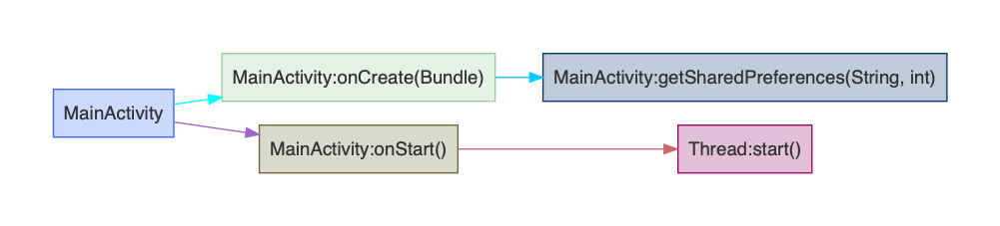

# booster-transform-lint

This module is used for potential performance issues detecting.

## Lint Reports

The [dot](https://www.graphviz.org/doc/info/lang.html) format reports is located at `build/reports/${variant}/booster-transform-lint/`,  you can convert the dot files to PNGs by using the following command:

```bash
find build/reports -name '*.dot' | xargs -I{} dot -O -Tpng {}
```

Here is an example generated by dot:



## Properties

The following table shows the properties that transformer supports:

| Property                         | Description                                                  | Example                            |
| -------------------------------- | ------------------------------------------------------------ | ---------------------------------- |
| `booster.transform.lint.apis`    | URI of API list（Using [built-in API list](src/main/kotlin/com/didiglobal/booster/transform/lint/constants.kt#L170) by default） | file://Users/booster/lint-apis.txt |
| `booster.transform.lint.ignores` | comma separated wildcard patterns to ignore                  | android/\*,androidx/\*             |

The properties can be passthrough the command line as following:

```bash
./gradlew assembleDebug -Pbooster.transform.lint.ignores=android/*,androidx/*
```

or configured in the `gradle.properties`:

```properties
booster.transform.lint.ignores=android/*,androidx/*
```

